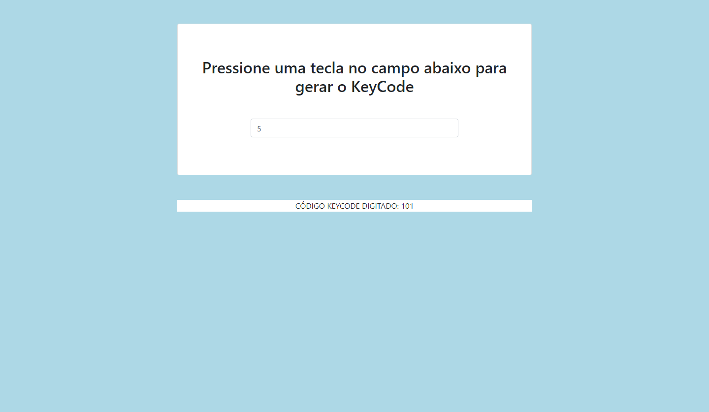

## Introdução

[Projeto Evento KeyCode](https://evento-keycode.vercel.app/)

Este readme está dividido em:

- Introdução
- Descrição
- Funcionalidades
- Como instalar
- Imagem

## Descrição

Trata-se de uma página html simples para pegar o keycode da tecla digitada.

## Funcionalidades

Ao clicar no campo de texto e digitar uma tecla qualquer, uma div abaixo será acionada informando o código javascript keycode da tecla pressionada.

## Como instalar

Para instalar, basta baixar ou clonar o projeto e abrir o arquivo "index.html" em seu navegador favorito.
Porém, você também pode acessar o site do projeto [clicando aqui](https://evento-keycode.vercel.app/)

## Imagem do Projeto

